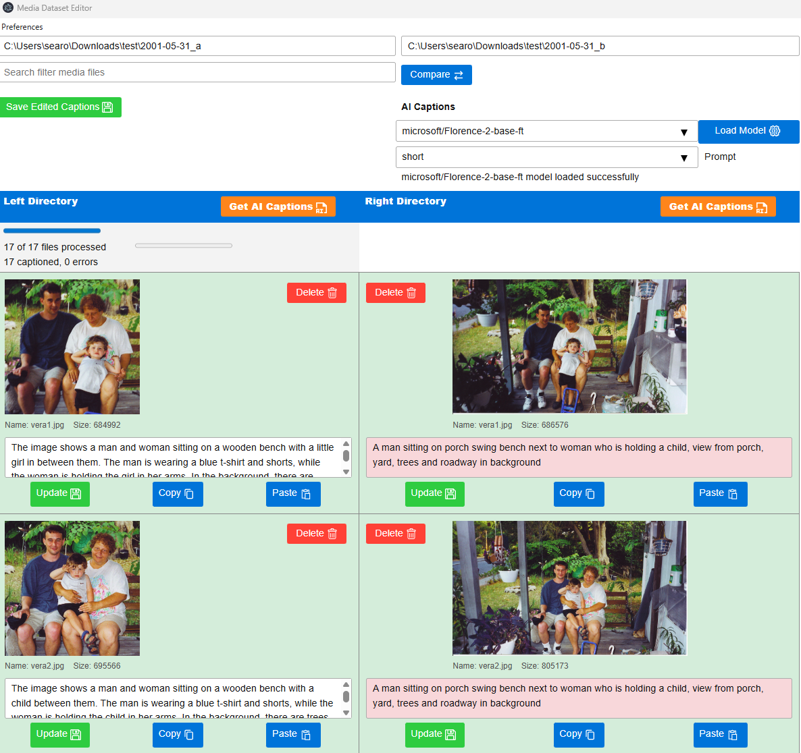
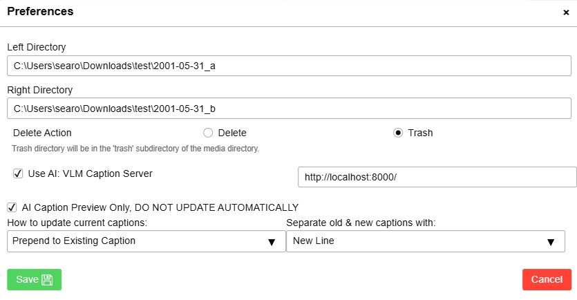

# Dataset Dedupe
Use this Electron app to compare image directories and captions. By comparing images as well as captions, it will help you clean up redundant media files and old captions.
You can use the optional [VLM Caption Server](https://github.com/git9875/vlm_caption_server) so that AI can automatically generate captions for your images.

## Overview
This app is an embedded web application for managing local image files and dataset caption files. It includes deduplication and AI auto-captioning features.

Video files will be supported in the future.

## Installation
```bash
git clone https://github.com/git9875/dataset_dedupe.git
cd dataset_dedupe
npm install
npx electron .
```

## Usage
### Starting Directories
When starting the app with `npx electron .`, the two directory text boxes will be empty, unless the two directories are set in your preferences (configuration). You can override this by setting the two directories on the command line.
```npx electron . "C:\path\to\left\directory" "C:\path\to\right\directory"```

With the two directories set in the app, click the Compare button to start comparing the two directories. You'll see the images displayed side by side in the table below. You can filter these images by name by with the search box to the left of the Compare button, and clicking Compare again.

The "Save Edited Captions" button is used to save all of the edited (changed) captions to their respective text files.

**Screenshot of the app in action:**




### AI Captions dropdown lists
If you have AI Captioning configured, the dropdown lists will be populated with the available models and prompts for you to select from. See [AI Captioning](#ai-captioning) below for configuration details. Select the model first, and click Load Model. Next, select the prompt to tell the AI how you want it to caption the images. You'll get 3 prompt options (detailed, short, and tags).

After the images are loaded, you can click the Get AI Captions button which will start the process of generating captions for all of the images in the directory of the respective column.


### Image Comparison Table
The images from both directories will be displayed in the table below, with two columns corresponding to the directories in the text boxes. Ignore the orange Get AI Caption buttons for now until you have configured it to use the AI captioning feature (see [AI Captioning](#ai-captioning) below).

**Feature Summary**
- Delete button: Deletes the image (and corresponding caption file). If you have selected "trash" as the delete action (in Preferences), the image will be moved to the trash subdirectory. If you have selected "delete" as the delete action, the image will be permanently deleted.
- Copy button (next to image): Copies the image (and corresponding caption file) from the directory on this side to the directory on the other side.
- Image preview: self explanatory
- Image file name and size: The rows in this table correspond to matching file names. When checking for duplicates, look at the file size (in bytes) to be sure.
- Caption box: The caption box is where you can edit the caption for the image. The caption is saved to a text file with the same name as the image file, but with a .txt extension. The app will signify that a caption text has been modified from its source by changing the background color to pink. The caption is saved to its caption file when you click the Update button or the Save Edited Captions button (near the top).
- Copy button (below caption box): Make this caption text the source for pasting into other caption boxes. This is useful for when you can't or don't want to use copy and paste keyboard shortcuts.
- Paste button: Paste the copied caption text into this caption box.


## Preferences (Configuration)
To open up the Preferences dialog, click on the Preferences menu button in the top left corner of the app.

**Feature Summary**
- Left Directory: Set the left directory path here if you want the app to always load this path when you restart (unless overridden on command line).
- Right Directory: Set the right directory path here if you want the app to always load this path when you restart (unless overridden on command line).
- Delete Action: When you delete an image, do you want it to really delete the image, or would you rather it be moved to a trash subdirectory, just in case you change your mind later?
- "Use AI: VLM Caption Server": Checking this box opens up more configurations. The URL for the VLM Caption Server will default to `http://localhost:8000/` but you can change that in this text box.
- "AI Caption Preview Only, DO NOT UPDATE AUTOMATICALLY": By checking this box, the AI will respond back with the captions (and fill in the caption boxes), but it will not update the caption files automatically.
- How to update current captions: (in preview only mode) When it responds with the generated caption, how do you want to update the caption text box?
    - Replace: replaces all of the text in the caption box
    - Prepend: inserts the AI caption at the beginning of the existing caption
    - Append: appends the AI caption after existing caption
- Separator old & new captions with: If you selected Prepend or Append before, how do you want to separate the old and new captions, a space or a new line? (Yes, I'm aware that this feature may be useless for most, but it could be useful for some.)

When you click the Save button, your preferences get updated in the `app_config.json` file at the base of this project. You'll get an error message if you enable AI and it cannot detect the VLM Caption Server through the `http://localhost:8000/` address.



## AI Captioning
To use the AI captioning feature, you must have the [VLM Caption Server](https://github.com/git9875/vlm_caption_server) running locally. The app is configured to use the AI captioning service at `http://localhost:8000/` by default. You can change this URL in the [Preferences](#preferences-configuration) dialog. The AI captioning feature is disabled by default. To enable it, check the "Enable AI Captioning" checkbox in the Preferences dialog. You must also [load a model and select a prompt](#ai-captions-dropdown-lists) (above the table).

When you click the Get AI Caption button, the app will send a request to start a batch job to caption all images in the directory of that column. It might take some time to start the process (because the model might not be loaded completely), but when it gets started, the progress bar will show how many images have been captioned. The caption boxes for each image will be updated according to your [Preferences](#preferences-configuration). The preferences also allow "preview only" mode which will not update the caption files automatically. In preview only mode, the caption box will be updated with text and the background color will change to pink to let you know that it has changed and it has not been saved yet. To save just one caption, click the Update button. To save all captions, click the Saved Edited Captions button near the top.

----

## Contributing
I am open to suggestions and feedback. If there is a locally-run VLM that is great at captioning images or videos, I may want to include it in this project in the future.
Contributions are welcome! If you encounter any issues or have suggestions for improvements, please open an issue or submit a pull request.

## License
This project is licensed under the [Apache 2.0 License](https://www.apache.org/licenses/LICENSE-2.0).  
You are free to use, modify, and distribute with minimal restriction.

## Acknowledgements
Special thanks to the open-source community for their contributions and support.
- [OpenJS Foundation and Electron contributors](https://www.electronjs.org/)
- [Node.js](https://nodejs.org/)
- Vectors and icons by [SVG Repo](https://www.svgrepo.com)
- [Picnic minimal CSS framework](https://picnicss.com/docs)
